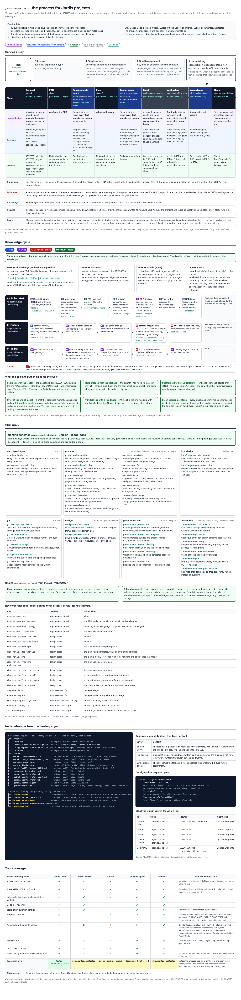

# jardis/dev-skills

**Gives your AI coding agent the rules and APIs of Jardis.** Jardis is the Domain-Driven Design platform for PHP: you model your domain, and Jardis generates the production-ready hexagonal code. This Composer plugin installs 33 bundled skills, the skills of every Jardis package you use, an `AGENTS.md` process router and reviewer agent files into your project, so Claude Code, Codex, Cursor, GitHub Copilot and Gemini CLI find them. No configuration is needed.

> Part of **[Jardis](https://jardis.io)** — the Domain-Driven Design platform for PHP. You model your domain; Jardis generates the production-ready hexagonal code (DTOs, Command/Query handlers, repositories, persistence). This plugin keeps your AI agent in sync with the rules and APIs that generated code follows.

[](https://jardistools.github.io/dev-skills/overview.html)

The same overview as a web page: [overview.html](https://jardistools.github.io/dev-skills/overview.html).

The overview in German: [overview.de.html](https://jardistools.github.io/dev-skills/overview.de.html).

---

## What does the plugin do?

After `composer install` or `composer update`, the plugin does the following in your project root:

1. **Skills.** It copies the 33 bundled skills and every skill of a `jardis*` vendor package (`vendor/<vendor>/<package>/.claude/skills/<name>/`) into two folders: `.claude/skills/` and `.agents/skills/`.
2. **`AGENTS.md`.** It writes one managed block into `AGENTS.md`. The block opens with a process router (work tiers, the phase-to-skill table, a pointer to the knowledge pool, optionally the git rules) and then aggregates the `AGENTS.md` of every Jardis vendor package.
3. **`CLAUDE.md`.** It adds a managed block that imports `@AGENTS.md`.
4. **`.gemini/settings.json`.** It lists `AGENTS.md` in `context.fileName`.
5. **Reviewer agents.** It writes the 19 reviewer roles of the `process-review-board` skill as agent files for five tools (see [Reviewer agent files](#reviewer-agent-files)).
6. **Manifest.** It records every skill folder it installed in `.claude/skills/.jardis-managed.json`; update and uninstall touch only what the manifest lists.
7. **Git exclude block.** It writes a managed block into `.git/info/exclude` (see [`process-docs`](#where-the-generated-files-go-process-docs)).

The add-ons — the `CLAUDE.md` block, the Gemini entry, the reviewer agent files and the exclude block — only warn when they fail; they never stop the install.

The bundled skills also contain a development process: tier choice, concept, PRD, plan, review board, stage run, verification and closing. Two tools for it ship with the package: the knowledge pool checker and the `commit-msg` hook (see [Process tools](#process-tools)).

---

## Supported tools

| Tool | Status | What the plugin writes for it |
|---|---|---|
| Claude Code | **tested** | `.claude/skills`, `AGENTS.md` imported from `CLAUDE.md`, `.claude/agents` |
| Codex | documented, not tested | `.agents/skills`, `AGENTS.md`, `.codex/agents` |
| Cursor | documented, not tested | `.agents/skills`, `AGENTS.md`, `.cursor/agents` |
| GitHub Copilot | documented, not tested | `.agents/skills` and `.claude/skills`, `AGENTS.md`, `.github/agents` |
| Gemini CLI | documented, not tested | `.agents/skills`, `.gemini/settings.json` with `AGENTS.md`, `.gemini/agents` |

**tested** means: the process was run with the tool and each check listed below passed. **documented, not tested** means: the vendor documentation says the tool reads that location, we quote the passage below, and we have not run the process with that tool. Other tools are not covered.

Out of scope, even for the tools above: Codex Cloud and the Copilot cloud agent.

### Claude Code — tested

Claude Code 2.1.286, runs on 2026-09-30 and 2026-10-01. Each of these checks passed:

- **Tier choice:** the session names a tier with a reason and loads the entry skill of that tier without naming it in the answer.
- **Progress head:** the progress file carries its head for each phase, in order, and the pool check is green.
- **Failing check:** a red verification leads to one fix run and then to green.
- **Fresh verifier:** the verifier receives only the target artefact, the acceptance criteria and the code.
- **Questions:** at most two points per question; an open question ends in a stop marker or in a gate.
- **Closing:** a digest is written, the work folder is deleted, lessons are recorded through `knowledge-record-decision` with a note.
- **Hook:** the `commit-msg` hook warns (exit code 0) on a `feat:` commit without a `Wissen:` note and stays silent with one. Checked by deterministic hook tests, not by a smoke run.
- **Honesty:** the verdict names every deviation.
- **Git gates:** the session creates no commit, merge or branch of its own, asks for the commit at each gate, and adds no tool attribution.

Documentation read for the `AGENTS.md` import (no test claim):

| File kind | Quote | URL | Retrieved |
|---|---|---|---|
| AGENTS.md | “By default, Claude reads AGENTS.md only when you have no CLAUDE.md in your working directory or above it.”; “Reading AGENTS.md directly requires Claude Code v2.1.277 or later.”; “A CLAUDE.md containing @AGENTS.md: you can leave it.” | https://code.claude.com/docs/en/memory | 2026-10-01 |

Re-checked before each release.

### Codex — documented, not tested

| File kind | Quote | URL | Retrieved |
|---|---|---|---|
| AGENTS.md | “Codex concatenates files from the root down, joining them with blank lines.”; “stops adding files once the combined size reaches the limit defined by project_doc_max_bytes (32 KiB by default)” | https://learn.chatgpt.com/docs/agent-configuration/agents-md | 2026-10-01 |
| Skills | “For repositories, Codex scans .agents/skills in every directory from your current working directory up to the repository root.” | https://learn.chatgpt.com/docs/build-skills | 2026-10-01 |
| Sub-agents | “add standalone TOML files under ~/.codex/agents/ for personal agents or .codex/agents/ for project-scoped agents.”; “Every standalone custom agent file must define: name description developer_instructions” | https://learn.chatgpt.com/docs/agent-configuration/subagents | 2026-10-01 |

Re-checked before each release.

With many vendor packages the managed `AGENTS.md` block can grow past 32 KiB. The router stands first in the block, ahead of the aggregated package content. The plugin prints a warning when `AGENTS.md` exceeds 32,768 bytes and still writes the file.

### Cursor — documented, not tested

| File kind | Quote | URL | Retrieved |
|---|---|---|---|
| AGENTS.md | “You can place AGENTS.md files in any subdirectory of your project, and they will be automatically applied when working with files in that directory or its children.” | https://cursor.com/docs/rules | 2026-10-01 |
| Skills | “A .cursor/skills/ (or .agents/skills/) folder anywhere inside your repository is picked up” | https://cursor.com/docs/skills | 2026-10-01 |
| Sub-agents | “Create a subagent file at .cursor/agents/verifier.md with YAML frontmatter (name, description) followed by the prompt.”; “Model to use: inherit or a specific model ID.” | https://cursor.com/docs/subagents | 2026-10-01 |

Re-checked before each release.

### GitHub Copilot — documented, not tested

| File kind | Quote | URL | Retrieved |
|---|---|---|---|
| AGENTS.md | “You can create one or more AGENTS.md files, stored anywhere within the repository. When Copilot is working, the nearest AGENTS.md file in the directory tree will take precedence.” | https://docs.github.com/en/copilot/how-tos/copilot-on-github/customize-copilot/add-custom-instructions/add-repository-instructions | 2026-10-01 |
| Skills | “Project skills, stored in your repository (.github/skills, .claude/skills, or .agents/skills)” | https://docs.github.com/en/copilot/concepts/agents/about-agent-skills | 2026-10-01 |
| Custom agents | “This will open a template agent profile called my-agent.agent.md in the .github/agents directory of your target repository.” | https://docs.github.com/en/copilot/how-tos/copilot-on-github/customize-copilot/customize-cloud-agent/create-custom-agents | 2026-10-01 |

Re-checked before each release.

Copilot reads both `.claude/skills` and `.agents/skills` (quote above), and the plugin fills both with the same skills. Copilot may therefore show an entry twice; we have not verified this.

### Gemini CLI — documented, not tested

| File kind | Quote | URL | Retrieved |
|---|---|---|---|
| AGENTS.md | “While GEMINI.md is the default filename, you can configure this in your settings.json file.”; “use the context.fileName property” | https://geminicli.com/docs/cli/gemini-md/ | 2026-10-01 |
| Skills | “Workspace skills: Located in .gemini/skills/ or the .agents/skills/ alias.” | https://geminicli.com/docs/cli/skills/ | 2026-10-01 |
| Sub-agents | “Project-level: .gemini/agents/*.md (Shared with your team)”; “subagents cannot call other subagents” | https://geminicli.com/docs/core/subagents/ | 2026-10-01 |

Re-checked before each release.

---

## Installation

```bash
composer require --dev jardis/dev-skills
```

Requirements: PHP >= 8.3, Composer >= 2, and an `allow-plugins` entry for the plugin, so that Composer is allowed to run it:

```json
{
    "config": {
        "allow-plugins": {
            "jardis/dev-skills": true
        }
    }
}
```

After installation you will see a line such as:

```
Jardis Skills installed: <N> skills, <M> AGENTS.md aggregated. See https://docs.jardis.io/en/skills
```

From that point on, your project contains (excerpt):

```
your-project/
├── .claude/
│   ├── skills/
│   │   ├── .jardis-managed.json       ← manifest: what the plugin installed
│   │   ├── foundation-architecture/   ← bundled skill
│   │   ├── process-concept/           ← bundled skill
│   │   ├── adapter-cache/             ← from vendor/jardisadapter/cache/
│   │   └── ...
│   └── agents/                        ← reviewer agent files (Claude Code)
├── .agents/
│   └── skills/                        ← the same skills for the other tools
├── .codex/agents/  .cursor/agents/  .github/agents/  .gemini/agents/
├── .gemini/settings.json              ← lists AGENTS.md in context.fileName
├── AGENTS.md                          ← process router + aggregated package AGENTS.md
└── CLAUDE.md                          ← imports @AGENTS.md
```

The plugin acts on `composer install` and `composer update` (Composer's post-install and post-update events). In Composer's global context (`composer global ...`) it writes and deletes nothing.

### `--no-plugins`

`composer install --no-plugins` loads no plugin, so nothing happens and the plugin cannot print a message. To catch up, run `composer install` once without the flag.

---

## Update and downgrade

**No downgrade.** A downgrade below 1.4.0 is not supported. Version 1.3.x does not know the manifest `.claude/skills/.jardis-managed.json`; on uninstall it removes skill folders by name prefix (`adapter-`, `core-`, `support-`, `tools-`, `schema-`, `plan-`, `platform-`, `rules-`). From 1.4.0 on, a guard applies: if the manifest was written by a newer plugin version (or a newer manifest schema), an older plugin changes nothing and prints a warning. This holds for install and uninstall. A manifest the plugin cannot read is ignored with a warning.

**Update from 1.3.x.** Version 1.4.0 renamed 18 bundle skills to a scheme of area prefixes (for example `rules-architecture` is now `foundation-architecture`; `RenamedSkills` lists all 18). The update migrates as follows:

- Each old skill folder the plugin installed in `.claude/skills` is replaced by a small redirect skill under the old name that points to the new name (as long as your `bundled-skills` config still selects it). The console lists the old-to-new pairs. The redirect skills are removed in 2.0.0; use the new names before then.
- Old `bundled-skills` globs keep working: a glob that matches an old name also selects the name the skill carries now (`platform-*` selects the five `generated-code-*` skills).
- 1.3.x wrote no manifest. In the first run the fixed list of the 18 old names decides what the plugin may replace, never a name prefix. Every old folder is copied to `.claude/.jardis-backup/` before it is replaced, so local edits survive.
- **The migration takes effect only in the second Composer run after the update.** The update run itself is still driven by the old plugin code and does not migrate. After `composer update jardis/dev-skills`, run `composer install` once more.
- The default of `bundled-skills` changed: without the key, all 33 skills are installed (1.3.x installed only three).

**Windows is not tested.** The continuous integration runs on Linux only (`ubuntu-latest`).

**Symlinked skills folder.** If `.claude/skills` or `.agents/skills` is a symlink to a folder outside the project, the install writes into that folder. The removal of deselected skills and the uninstall do not follow the link: they leave the folder and its content in place and print a warning. Clean such a folder up by hand. A single skill folder that is a symlink is treated the same way when deselected skills are removed and on uninstall: it is neither backed up nor removed, and the plugin warns.

---

## Which skills are installed?

The 33 bundled skills come with the plugin. Their names start with the prefix of their area:

| Prefix | Skills |
|---|---|
| `start-` | `start-orientation` — entry point, routes into the other skills |
| `packages-` | `packages-find-existing` — the package catalog (see [Package catalog](#package-catalog-packages-find-existing)) |
| `design-` | `design-draft-schema`, `design-headless-mcp` |
| `generated-code-` | `generated-code-extend`, `generated-code-wire-transport`, `generated-code-versioning`, `generated-code-workflow-api`, `generated-code-recipes` |
| `foundation-` | `foundation-architecture`, `foundation-patterns`, `foundation-testing`, `foundation-frontend-review`, `foundation-php`, `foundation-working-principles` |
| `git-` | `git-setup-repository`, `git-start-branch`, `git-commit-change`, `git-push-and-open-pr`, `git-check-compliance` |
| `knowledge-` | `knowledge-maintain-pool`, `knowledge-record-decision` |
| `process-` | `process-choose-tier`, `process-concept`, `process-write-prd`, `process-write-plan`, `process-review-board`, `process-run-stage`, `process-verify`, `process-close`, `process-resume`, `process-check-existing` |
| `code-review-` | `code-review-change` |

Skills of Jardis packages are added on top. The plugin scans `vendor/jardis*/*/.claude/skills/*/SKILL.md`; those packages use the prefixes `adapter-`, `core-`, `support-` and `tools-`. If a bundled skill and a vendor skill have the same name, the bundled skill wins and the console shows a warning.

Skills you wrote yourself are not touched, as long as no installed skill has the same name: the plugin removes and replaces only folders listed in the manifest.

Which of the bundled skills are installed is controlled by `bundled-skills` (next section).

---

## Configuring bundled skills

The mandatory groups `foundation-*` and `process-*` are always installed. Everything else is controlled via `composer.json`:

```json
{
    "extra": {
        "jardis/dev-skills": {
            "bundled-skills": true
        }
    }
}
```

**Accepted values:**

| Value | Effect |
|---|---|
| Key absent, or `true` | All 33 bundled skills (default) |
| `false`, or `[]`, or `{ "include": [] }` | Only the mandatory groups `foundation-*` and `process-*` |
| `["git-*", "design-*"]` | Whitelist: the matching skills plus the mandatory groups |
| `{ "include": [...], "exclude": [...] }` | `include` first, then `exclude`; an absent `include` means all skills; the mandatory groups are always added |
| Anything else (for example `42`) | Warning, treated as `false` |

An `exclude` glob that hits a mandatory skill has no effect and prints a warning. Skills of vendor packages are not affected by `bundled-skills`.

**Examples:**

```json
"bundled-skills": ["git-*"]
```
Installs the `git-*` skills plus `foundation-*` and `process-*`.

```json
"bundled-skills": {
    "include": ["generated-code-*", "design-*"],
    "exclude": ["design-headless-mcp"]
}
```
Installs the `generated-code-*` skills and `design-draft-schema`, plus the mandatory groups.

```json
"bundled-skills": {
    "exclude": ["git-*"]
}
```
Installs all bundled skills except the `git-*` skills (a missing `include` means all).

**Pattern syntax:** shell globs via `fnmatch()` — `*` matches anything, `?` matches one character. No regex. Globs written for the 1.3.x names (`platform-*`, `rules-*`, `do-*`, `schema-*`, `jardis-*`) still work; see [Update and downgrade](#update-and-downgrade).

**Sync behavior:** the config is the source of truth. If you narrow `bundled-skills`, the next `composer install` removes the deselected bundled skills from `.claude/skills/` and `.agents/skills/`. A deselected folder that you changed locally is first copied to `.claude/.jardis-backup/`. Vendor skills and your own skills are left alone.

**Invalid config** (for example `bundled-skills: 42`): console warning, falls back to `false` (the mandatory groups only). No abort.

### Git rules in the router (`git-rules`)

By default the process router in `AGENTS.md` states the git rules: branch, commit and merge are gates of the human, no tool attribution in commits, and Git flow (`feature/*` and `fix/*` from `develop`, hotfixes from `main`). `"git-rules": false` takes these sentences out of the router; the git skills stay installed. Any other value than `true` or `false` keeps the rules on and prints a warning. The key is independent of `bundled-skills` and `process-docs`, and it enforces nothing: no hook rejects a commit and no `settings.json` rule is written.

```json
{
    "extra": {
        "jardis/dev-skills": {
            "git-rules": false
        }
    }
}
```

`git-start-branch` creates a branch from `origin/develop` (hotfixes from `origin/main`), so it needs a remote named `origin` and a `develop` branch.

### Where the generated files go (`process-docs`)

The files the plugin generates (the skill folders, `AGENTS.md`, the reviewer agent files, the manifest) are meant to be committed, so the whole team gets the same skills. The folder `.claude/.jardis-backup/` is never meant for a commit; the exclude block lists it in both modes.

```json
{
    "extra": {
        "jardis/dev-skills": {
            "process-docs": "local"
        }
    }
}
```

| Value | Effect |
|---|---|
| `committed` (default, also when the key is absent) | Everything is left to the commit; the exclude block holds only the backup folder |
| `local` | The exclude block in `.git/info/exclude` also keeps the process document folders (`docs/vorhaben/`, `docs/digests/`, `.claude/wissen/`), the skill folders and files the plugin installed, and the manifest out of the commit |
| Anything else | Warning, treated as `local` |

`.gitignore` is never touched, and the plugin never stages, commits or untracks anything. Git cannot hide files it already tracks; the plugin lists those in a warning, and you run `git rm --cached` yourself. Without a Git repository at the project root (or with the project below the top of a larger work tree) the exclude block is not written and the plugin warns; the rest of the install runs normally.

### Skill listing budget

Every skill description is part of the skill listing the agent sees in each session. Claude Code truncates that listing at 1 % of the context window and cuts each single description at 1,536 characters (see the Claude Code skills documentation, https://code.claude.com/docs/en/skills). The Claude Code setting for the listing budget is `skillListingBudgetFraction`. With 33 bundled skills, the skills of your Jardis packages and two skill folders, the listing can reach that limit; the tail of the trigger text or whole skills may then be missing. The bundled skills keep their descriptions short (new skills: at most 45 words, see `docs/SKILL-FORMAT.md`). If skills go missing from the listing, narrow `bundled-skills`.

---

## Reviewer agent files

The 19 reviewer roles of `process-review-board` live in `skills/process-review-board/reviewers/`. For each role the plugin writes one agent file per tool:

| Tool | Path |
|---|---|
| Claude Code | `.claude/agents/<role>.md` |
| Codex | `.codex/agents/<role>.toml` |
| Cursor | `.cursor/agents/<role>.md` |
| GitHub Copilot | `.github/agents/<role>.agent.md` |
| Gemini CLI | `.gemini/agents/<role>.md` |

A file the plugin did not write itself is never overwritten; the plugin leaves it and warns. A link at the target path or in a folder on the way is never followed. On uninstall the plugin deletes the files it wrote and removes their folders when they are empty.

---

## Process tools

**Knowledge pool checker.** `scripts/pool-check.php` is linked as `vendor/bin/pool-check.php`. It checks the page layout, links, path references and size caps of the pool in `.claude/wissen/`, and the progress head and plan caps of the work folders in `docs/vorhaben/`. It only reads.

```bash
vendor/bin/pool-check.php [--root=<dir>]
```

Exit code: 0 clean, 1 violations found, 2 usage error or no pool.

**`commit-msg` hook.** A `feat:` or `fix:` commit should carry a `Wissen:` note: `Wissen: <page>#<section>` or `Wissen: keins – <reason>`. The hook only warns; it never rejects a commit (it exits with 0 whatever the message says). Install it from the project root:

```bash
sh vendor/jardis/dev-skills/scripts/install-commit-msg-hook
```

It writes `.husky/commit-msg`, the hook in `core.hooksPath`, or `.git/hooks/commit-msg`, whichever your setup uses, and never changes a hook that already exists. For CaptainHook, GrumPHP and Lefthook it prints the snippet to add. The `git-setup-repository` skill runs the same installer. `scripts/check-commit-messages <from>..<to>` runs the same check over a commit range, for example in CI; it reports warned messages on stderr and still exits with 0.

---

## Package catalog (`packages-find-existing`)

`packages-find-existing` is a discovery skill. It lists every Packagist-published Jardis package with a brief capability description, a "use when" trigger and the exact `composer require` command. When an AI agent is about to build a reusable component from scratch — caching, scheduling, HTTP clients, validation, workflow orchestration or other scaffolding — the catalog helps it find the matching Jardis package and recommend `composer require <package>` instead. The full API skill of a package becomes available only after you install the package. The catalog is thin on purpose: no class names, no API details.

`catalog/manifest.json` in this repository holds the curated package descriptions. `bin/generate-catalog.php` renders them into `skills/packages-find-existing/SKILL.md`, which is committed and shipped with the plugin. No network access is needed at install time.

To leave the catalog out, use an explicit list that does not select it, for example `["git-*"]`; it is then not installed. `{ "exclude": ["packages-find-existing"] }` alone installs all other bundled skills and leaves out only the catalog.

---

## Conflicts

### Skill directories

Before the plugin replaces or removes a skill folder, it checks whether the folder holds content the plugin did not put there (the manifest holds the checksum of what it installed). Such a folder is copied to `.claude/.jardis-backup/<name>` first; if that name is taken, the copy gets a timestamp suffix. Existing backups are never overwritten. The console shows a warning with the backup path:

```
<warning>jardis/dev-skills: existing skill "adapter-cache" differs from the managed state, saved to /path/.claude/.jardis-backup/adapter-cache</warning>
```

A `<name>.backup` folder left behind by plugin versions up to 1.3.x is moved into `.claude/.jardis-backup/` as well. The backups are **not** deleted automatically; you decide whether you need them. The folder is never meant for a commit.

### AGENTS.md

The plugin manages a **managed block** in `AGENTS.md` between the markers `<!-- BEGIN jardis/dev-skills ... -->` and `<!-- END jardis/dev-skills -->`. Everything outside these markers belongs to you and is left untouched.

If an aggregated source package ships its **own** managed block in its `AGENTS.md`, those markers are **stripped** during aggregation. The result therefore always has exactly one BEGIN/END pair, never nested markers.

- **File does not exist yet:** the plugin creates `AGENTS.md`; the content is the managed block only.
- **File exists without markers** (your own `AGENTS.md`): the plugin moves the original to `AGENTS.md.backup` (a stale `AGENTS.md.backup` is replaced), carries your content into the new file and appends the managed block at the bottom. Console:
  ```
  <warning>jardis/dev-skills: existing AGENTS.md moved to /path/AGENTS.md.backup</warning>
  ```
- **File exists with markers** (re-run): the managed block is replaced in place; your content above and below remains unchanged.
- **Duplicate or nested markers** (for example left behind by an older plugin version): the plugin **self-heals**. The region from the first BEGIN to the last END is collapsed into a single fresh block, and a notice is printed.
- **Corrupt markers** (only the header, only the footer, or the first BEGIN after the last END): the install aborts with `InstallFailedException`. Fix the file manually and run `composer install` again.
- **`AGENTS.md` is a link, or lies behind one:** from 1.4.0 on the plugin no longer writes it. It leaves the file unchanged and warns. To keep the managed block, make `AGENTS.md` a regular file and let `CLAUDE.md` import it with `@AGENTS.md`.

---

## Uninstallation

```bash
composer remove jardis/dev-skills
```

The plugin removes exactly what it installed:

- The skill folders the manifest lists, in `.claude/skills` and `.agents/skills`, and the manifest itself. Without a manifest, a fixed list of the known bundle names (old and new) is used, plus the vendor-prefixed skill folders (`adapter-`, `core-`, `support-`, `tools-`) in `.claude/skills`, never a prefix match on the bundle areas; with a manifest that is defective or written by a newer version, nothing is removed.
- The managed block in `AGENTS.md`. Only the block in the file: the file is deleted. Block plus your own content: only the block is removed. Corrupt markers: the file is left untouched and the console shows a warning.
- The import block in `CLAUDE.md` (the file is deleted if only whitespace is left), the `AGENTS.md` entry in `.gemini/settings.json` (that file is deleted only if the plugin created it and nothing else is in it), the reviewer agent files the plugin wrote, and the exclude block in `.git/info/exclude`.

**Left untouched:**

- Your own skill folders, and any folder the manifest does not list
- `.claude/.jardis-backup/` and `AGENTS.md.backup`
- An `AGENTS.md` without markers (no Jardis aggregation, no reason to touch it)
- Any file behind a symlink; the plugin never follows links

`composer install --no-dev` does not remove anything: as long as the root package still requires the plugin, its removal is not a real removal.

---

## Shipping your own Jardis-compatible skills (for package maintainers)

If you are building a Composer package that should ship a skill to the plugin, two things are sufficient:

1. **Package name with a `jardis` prefix** (for example `jardisadapter/foo`, `jardissupport/bar`) — the plugin only scans `vendor/jardis*/`.
2. **Skill file** at `<package>/.claude/skills/<skill-name>/SKILL.md`. Recommended prefix: `adapter-`, `core-`, `support-` or `tools-`.
3. **Optional:** `<package>/AGENTS.md` in the package root. Its content is aggregated into the project `AGENTS.md` during install.

No further configuration is needed — no `extra:` block in `composer.json` is required. Do not reuse the name of a bundled skill: the bundled skill wins and the plugin warns.

---

## Troubleshooting

**Skills do not end up in the project**
The plugin triggers on `post-install-cmd` / `post-update-cmd`. If you call `composer require jardis/dev-skills` inside another Composer script, these events do not fire; run a separate `composer install` in the project root. The same holds after `--no-plugins` (see [Installation](#--no-plugins)). Also check the `allow-plugins` entry, and that you are not in `composer global`.

**After an update from 1.3.x the old names are still there**
The migration takes effect in the second Composer run. Run `composer install` once more (see [Update and downgrade](#update-and-downgrade)).

**The plugin changed nothing and warned about a newer manifest**
The manifest was written by a newer plugin version, and an older plugin does not downgrade it. Update the plugin.

**My `AGENTS.md` is not removed during uninstall**
This is intentional: if the file does not contain the managed block marker `<!-- BEGIN jardis/dev-skills ... -->`, the plugin assumes you have taken it over. Delete it yourself.

**`AGENTS.md` was not written**
A link at that path is never written. Make `AGENTS.md` a regular file (see [Conflicts](#agentsmd)).

**Vendor package has a skill but it is not copied**
Check: is the package name under `vendor/jardis*/`? The plugin scans exclusively `vendor/jardis*/*/.claude/skills/*/SKILL.md`. Packages without a `jardis` prefix are ignored.

**A skill folder of mine was moved**
This happens when a folder has the name of a skill the plugin installs and differs from the new content. You find a copy in `.claude/.jardis-backup/`. Renaming your folder resolves this permanently.

**Skills are missing from the agent's listing**
See [Skill listing budget](#skill-listing-budget).

---

## Development (plugin maintainers)

Docker-based via `make`:

```bash
make help                       # List all targets
make install                    # Run composer install
make update                     # Run composer update
make autoload                   # Run composer dump-autoload
make phpunit                    # Run all tests
make phpunit-reports            # Run all tests with reports
make phpunit-coverage           # Run all tests with coverage text
make phpunit-coverage-html      # Run all tests with HTML coverage
make phpstan                    # Run PHPStan analysis (level 8)
make phpcs                      # Run coding standards (PSR-12)
make validate-skills            # Validate every bundled SKILL.md against docs/SKILL-FORMAT.md
make generate-catalog           # Generate skills/packages-find-existing/SKILL.md from catalog/manifest.json
make generate-catalog-check     # Check that the checked-in SKILL.md matches the manifest (exit≠0 on drift)
make check-catalog-packagist    # Check Packagist for Jardis packages missing from catalog/manifest.json (warning only, exit 0)
make check-public-text          # Check publicly shipped texts for home paths and private denylist terms (env PUBLIC_TEXT_DENYLIST)
make check-changelog-top VERSION=1.4.0  # Exit 0 if the top version heading of CHANGELOG.md is the version to tag, any other exit means not releasable (the message says why)
make shell                      # Run a shell inside the phpcli container
make clean                      # Stop containers and clean up volumes
make remove                     # Stop and remove containers, images, network and caches
make ssh-agent                  # Get SSH agent ready
make install-hooks              # Install git hooks (pre-commit + pre-push)
```

Before a release tag run `make check-changelog-top VERSION=<x.y.z>`: exit 0 means the version matches, any other exit means the tag is not releasable and the message says why (`make` reports every failure as exit 2). The release notes are in [CHANGELOG.md](CHANGELOG.md). Notes for agents working in this repository are in [AGENTS.md](AGENTS.md).

Architecture: Closure-Orchestrator pattern (`src/SkillInstaller.php`, `src/SkillUninstaller.php`), handlers as `__invoke()` closures under `src/Handler/`, value objects under `src/Data/`. Composer events via `Composer\Plugin\PluginInterface` + `Composer\EventDispatcher\EventSubscriberInterface` in `src/Plugin.php`.

More details: <https://docs.jardis.io/en/skills>

---

## License

MIT — see [LICENSE.md](LICENSE.md).
